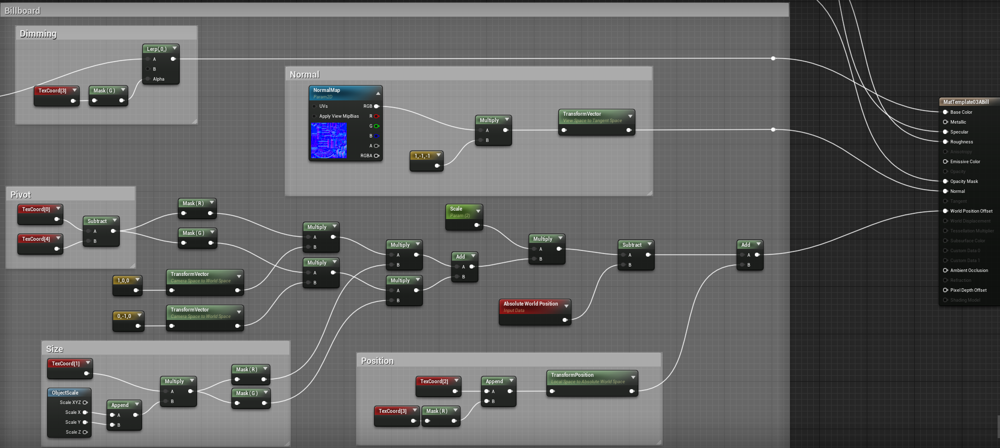

## Spt2Fbx

A simple tool that generates static meshes from .spt files and saves them as .fbx.
The release version supports speed trees up to version 4.1

Download: [GitHub - Spt2Fbx.zip](https://github.com/VenoMKO/Spt2Fbx/releases/download/v1.1/Spt2Fbx.zip)

## Usage

Drag & drop a folder or an .spt on the Spt2Fbx.exe.
The program will save .fbx files next to .spt sources.
***Make sure SpeedTreeRT.dll is in the same folder with the Spt2Fbx.exe***

Custom mesh data:
 - uv set 0: diffuse texture coordinates
 - uv set 1: leaf card width, height
 - uv set 2: leaf card position x, y
 - uv set 3: leaf card position z, leaf dimming
 - uv set 4: leaf card pivot u, v

 Example of a UE4 leaf material:

## Building

You will need third party libs:
  - SpeedTreeRT SDK 4.1
  - FbxSdk
  - dirent

Depending on the version of SpeedTree you will need Visual Studio 2005 or 2008
